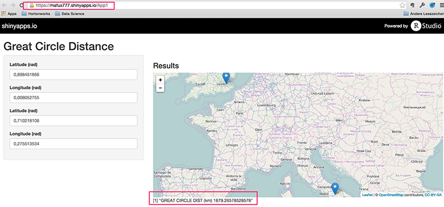

--- 
title       : Great Circle Distance between 2 points on Earth 
subtitle    : Demonstrating shiny 
author      : mafux777 
job         : Student 
framework   : io2012        # {io2012, html5slides, shower, dzslides, ...} 
highlighter : highlight.js  # {highlight.js, prettify, highlight} 
hitheme     : tomorrow     # 
widgets     : mathjax       # {mathjax, quiz, bootstrap} 
mode        : selfcontained # {standalone, draft} 
knit        : slidify::knit2slides 
---

## Introduction (Slide 2)

This is part of an assignment for the "Developing Data Products" class on
Coursera.

The assignment was to create an interactive shiny application taking some user
input, performing some calculation, and displaying the results.

Find the app here: https://mafux777.shinyapps.io/App1

--- .class #id

## Great Circle Distance Calculation (Slide 3)

This application calculates the Great Circle Distance between two points on
Earth. This is the shortest distance between two points on Earth and is often
the chosen path for aircraft travelling between the two points.

Given origin and destination in radian coordinates (latitude $ \lambda $ and
longitude $ \phi $), the Haversine formula for a perfect sphere looks like this:

$2 r \arcsin\left(\sqrt{\sin^2\left(\frac{\phi_2 - \phi_1}{2}\right) +
\cos(\phi_1) \cos(\phi_2)\sin^2\left(\frac{\lambda_2 -
\lambda_1}{2}\right)}\right)$

[https://en.wikipedia.org/wiki/Haversine_formula]

Hint: the Latex formula code is available in the Wikipedia article if you click
on edit and look at the source code.

--- .class #id
## Further Remarks for this Application (Slide 4)

The Haversine formula does not take into account that the earth is elliptical,
therefore I have implemented a more sophisticated algorithm described here
([http://www.r-bloggers.com/great-circle-distance-calculations-in-r/]).

If you want to check out the application with some coordinates and only have
lat/lon in degrees, you can divide by 180 and multiply by $ \pi $.

Southern latitudes and western longitudes are designated as negative. For
example, New York is 40°42′46″N 74°00′21″W, which would translate into $ \lambda
= 0.71057 \; \phi = -1.29164 $

```{r} 
(40+42/60+46/3600) * pi / 180
```

--- .class #id

## Screenshot (Slide 5)



--- .class #id


